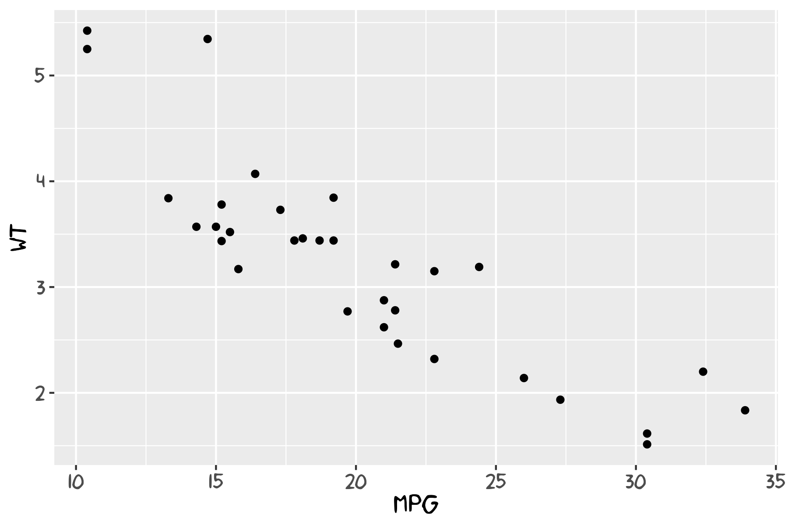
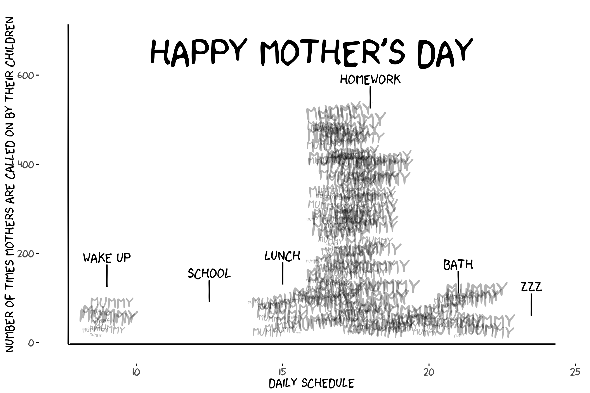
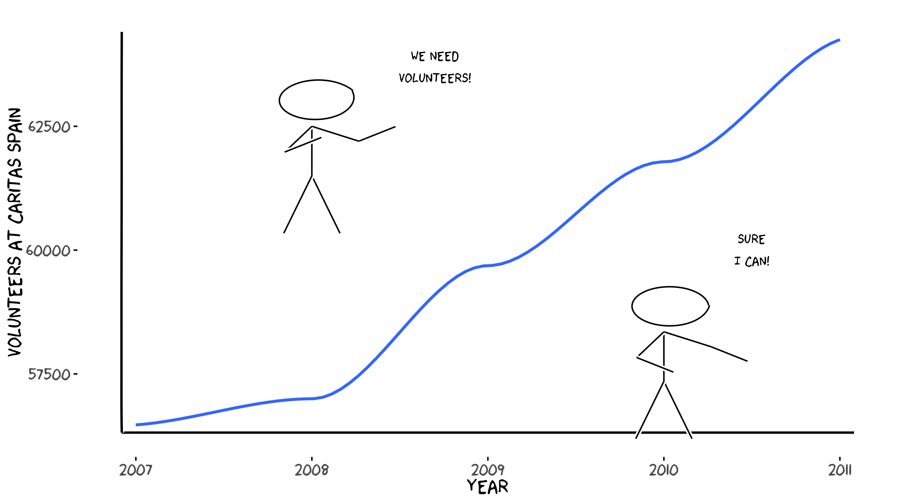

# xkcd


An R package to create hand-drawn (xkcd-style) plots and elements for ggplot2.

This repository contains the source for the `xkcd` package (development version). Originally from https://r-forge.r-project.org/projects/xkcd/ which is deprecated and now maintained independently.

## Install

Install the current development version from GitHub:

```r
# using remotes
remotes::install_github("ToledoEM/xkcd")

# or using devtools
devtools::install_github("ToledoEM/xkcd")
```

## Quick Start

```r
library(xkcd)
library(ggplot2)

df <- data.frame(x = 1:10, y = cumsum(runif(10, -0.5, 0.8)))

ggplot(df, aes(x = x, y = y)) +
  geom_xkcdpath(linewidth = 1, colour = "black") +
  theme_xkcd()
```

## Key Notes

- The package uses `Hmisc::bezier()` internally for smoothing paths.
- Uses `linewidth` (ggplot2 >= 3.4.0) for line thickness; older code using `size` is supported where possible.
- Requires xkcd fonts to be installed; see **Fonts** section below.

## Fonts

To use xkcd fonts in your plots, you need to install and register them with R's graphics system.

### Install xkcd Fonts

If xkcd fonts are not already installed on your system:

```r
library(extrafont)

# Download and install the font
download.file(
  "https://github.com/ipython/xkcd-font/blob/master/xkcd.ttf?raw=true",
  dest = "xkcd.ttf", mode = "wb"
)
font_import(pattern = "[X/x]kcd", prompt = FALSE)
```

### Load Fonts for Plotting

Before plotting, register fonts with your graphics device:

```r
library(xkcd)
library(extrafont)

# Load fonts for your output device
extrafont::loadfonts(device = "win", quiet = TRUE)  # or "pdf" or "postscript"

# Then create your plot
ggplot(...) + theme_xkcd()
```

### Automatic Font Loading (opt-in)

To automatically load fonts when the package is attached (opt-in):

```r
# Set before loading the package
options(xkcd.auto_load_fonts = TRUE)
library(xkcd)
```

This is opt-in to avoid surprising side-effects during package attach.

## Example Images

Below are three examples from the vignette:







## Development

Set up a development workflow with:

```r
# Regenerate documentation from roxygen comments
devtools::document()

# Run package checks (skip PDF manual if LaTeX not installed)
devtools::check(args = "--no-manual")

# Build vignettes
devtools::build_vignettes()

# Install from local source
devtools::install_local()
```

To render the vignette directly:

```r
rmarkdown::render("vignettes/xkcd-intro.Rmd")
```

## Dependencies

The package requires:

- **ggplot2** — Graphics framework
- **Hmisc** — Bezier curve interpolation
- **grid** — Low-level graphics primitives
- **extrafont** (optional) — Font management

Install dependencies with:

```r
install.packages(c("ggplot2", "Hmisc", "grid", "extrafont"))
```

## Contributing

Contributions, bug reports, and pull requests are welcome. Please open an issue with a description and minimal reproducible example if relevant.

## License

This package is released under the **MIT License**. See the [LICENSE](LICENSE) file for details.


